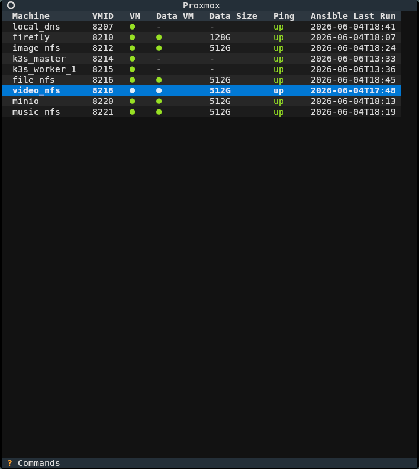
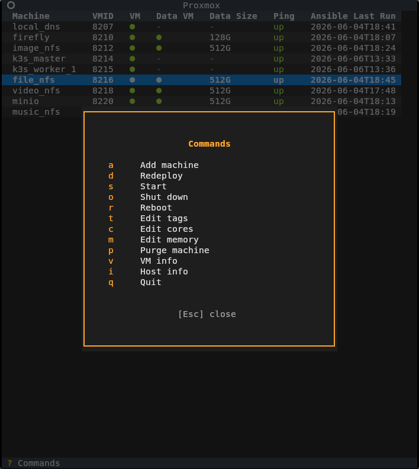
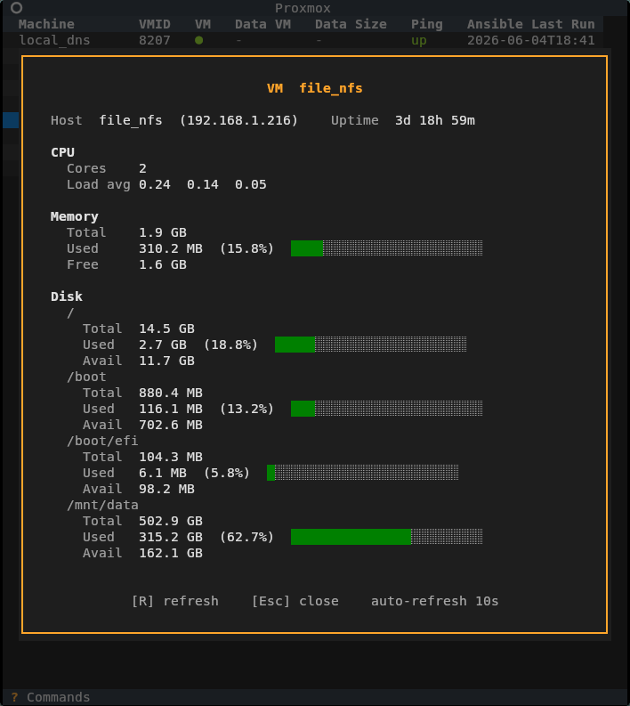
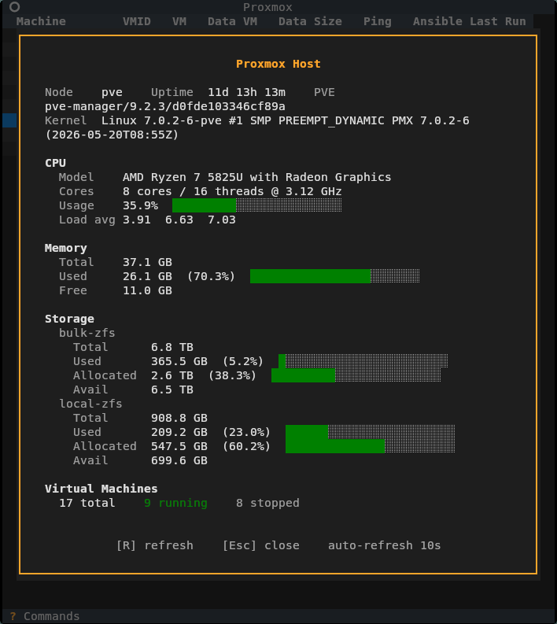

<h1 align="center">My Proxmox homelab setup</h1>

<p align="center">
  <it>There's always a lot left to do</it>
</p>

---

## Machine map

### ID ranges

| Range     | Use                   |
|-----------|-----------------------|
| 1000-1099 | Test VMs              |
| 2000-2099 | Test persistent disks |
| 8201-8255 | VMs                   |
| 8501-8555 | Persistent disks      |
| 9000-9099 | Templates             |

### Local machines

| VM             | VMID | Boot disk | Data disk | Notes                         |
|----------------|:----:|:---------:|:---------:|-------------------------------|
| `local_dns`    | 8207 | 16G       | -         | dnsmasq + nginx reverse proxy |
| `grafana`      | 8208 | 16G       | 256G      | grafana + influxdb database   |
| `firefly`      | 8210 | 16G       | 128G      | Economy tracking              |
| `image_nfs`    | 8212 | 16G       | 512G      | Image/photo storage NFS       |
| `k3s_master`   | 8214 | 32G       | -         | K3S cluster controller        |
| `k3s_worker_1` | 8215 | 400G      | -         | K3S worker node 1             |
| `file_nfs`     | 8216 | 16G       | 512G      | General file storage NFS      |
| `video_nfs`    | 8218 | 16G       | 512G      | Video storage NFS             |
| `minio`        | 8220 | 16G       | 512G      | S3-compatible object storage  |
| `music_nfs`    | 8221 | 16G       | 512G      | Music storage NFS             |

### Templates

| Name                  | VMID |
|-----------------------|:----:|
| `ubuntu-24-cloudinit` | 9000 |
| `nosys-data`          | 9002 |

## TUI helper

### Screenshots

A few example screenshots from the TUI interface I use to make things easier.
You can find more in `tui/screenshots`.

<table>
  <tr>
    <td></td>
    <td></td>
  </tr>
  <tr>
    <td></td>
    <td></td>
  </tr>
</table>

## Required environment files

### Firefly

```sh
export ANSIBLE_VAR_FIREFLY_DB_PASSWORD=""
export ANSIBLE_VAR_FIREFLY_APP_KEY=""
export ANSIBLE_VAR_FIREFLY_CRON_TOKEN=""
```

App-key and cron token should be 32-char.

### Grafana + InfluxDB

```sh
export ANSIBLE_VAR_GRAFANA_ADMIN_PASSWORD=""
export ANSIBLE_VAR_GRAFANA_SECRET_KEY=""
export ANSIBLE_VAR_INFLUXDB_ADMIN_PASSWORD=""
export ANSIBLE_VAR_INFLUXDB_ADMIN_TOKEN=""
```

### K3S master

```sh
export ANSIBLE_VAR_GITHUB_TOKEN=""
```

Needs repo-level `admin:rw` permissions to register runners from Github ARC.

### MinIO

```sh
export ANSIBLE_VAR_MINIO_ADMIN_PASSWORD=""
```

### Workflow run deleting helper

```sh
export DELETER_PAT=""
```

Needs repo-level `actions:rw` permissions to delete old workflow runs.
