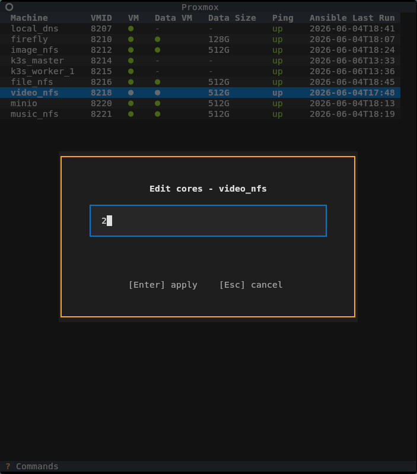
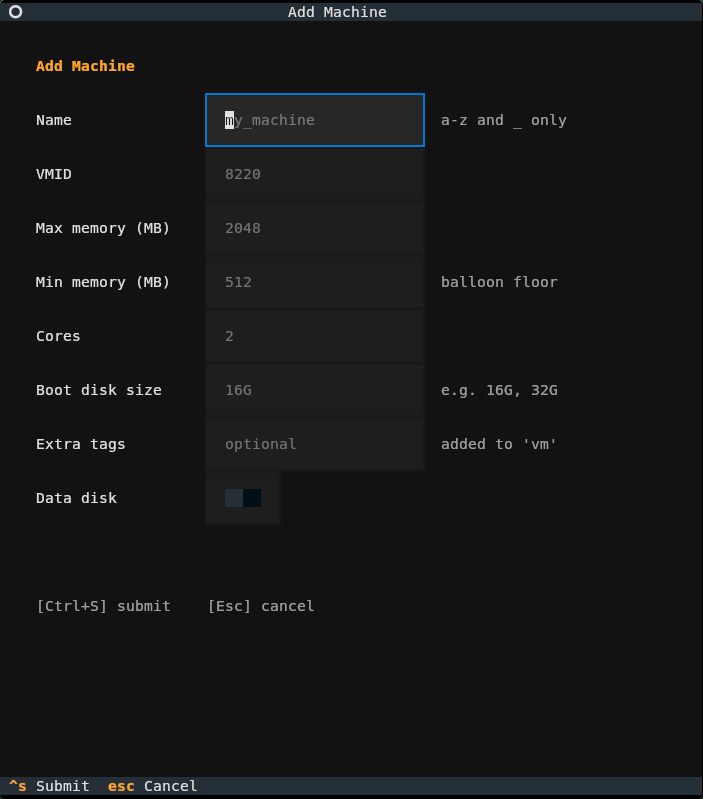
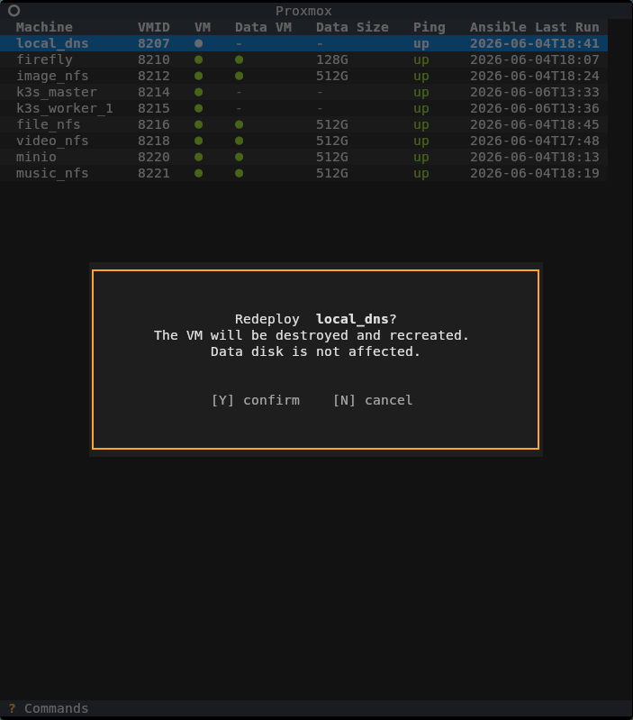
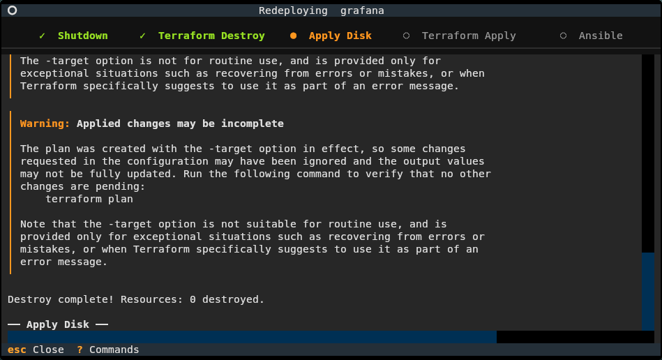
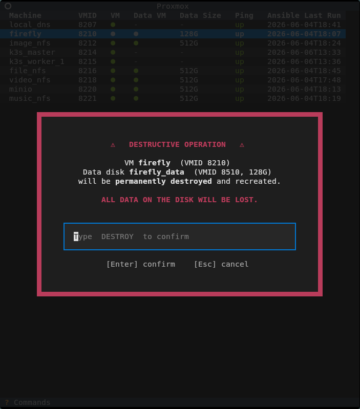
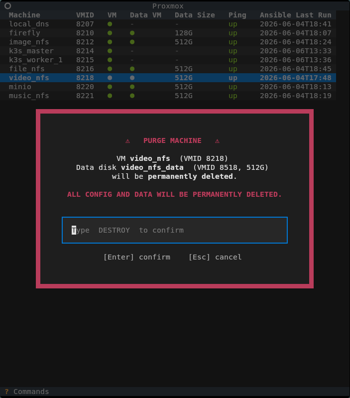

## Main screen

## Host info screen

## VM info screen

## Core allocation edit screen

## Commands help screen

## Add terraform machine config screen

## Redeploy confirm screen

## Redeploy in-progress screen

## Full redeploy confirm screen

## Machine purge confirm screen

